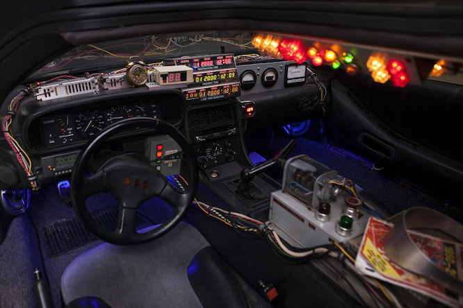

# DeLorean

Run `./88` to get up to speed.

Circuits
--------



Included by default:

  1. [environment][]
  1. [editor][]
  1. [utility][]
  1. [history][]
  1. [terminal][]
  1. [directory][]
  1. [completion][]
  1. [syntax-highlighting][]
  1. [history-substring-search][]
  1. [git][]
  1. [hub][]
  1. [prompt-pure][]

See [wiki][] for additional circuits.

Note: DeLorean only sequences circuits configured in [`flux-capacitor.zsh`][].

License
-------

[](https://tldrlegal.com/l/mit)

Copyright &copy; 2015-2018 Zsh DeLorean contributors.

Copyright &copy; 2011-2015 Sorin Ionescu and contributors.

Copyright &copy; 2009-2011 Robby Russell and contributors.

Thanks [@spcmd][] for the DeLorean ascii art!

```DeLorean
   __---~~~~--__                      __--~~~~---__
  `\---~~~~~~~~\\                    //~~~~~~~~---/'
    \/~~~~~~~~~\||                  ||/~~~~~~~~~\/
                `\\                //'
                  `\\            //'
                    ||          ||      Hey Doc!
          ______--~~~~~~~~~~~~~~~~~~--______
     ___ // _-~                        ~-_ \\ ___
    `\__)\/~                              ~\/(__/'
     _--`-___                            ___-'--_
   /~     `\ ~~~~~~~~------------~~~~~~~~ /'     ~\
  /|        `\                          /'        |\
 | `\   ______`\_         DMC        _/'______   /' |
 |   `\_~-_____\ ~-________________-~ /_____-~_/'   |
 `.     ~-__________________________________-~     .'
  `.      [_______/------|~~|------\_______]      .'
   `\--___((____)(________\/________)(____))___--/'
    |>>>>>>||                            ||<<<<<<|
    `\<<<<</'                            `\>>>>>/'

    Now, if my calculations are correct,
    when this baby hits 88 miles an hour,
    you're going to see some serious shit!
```

[environment]: https://github.com/zsh-delorean/circuit-environment
[utility]: https://github.com/zsh-delorean/circuit-utility
[completion]: https://github.com/zsh-delorean/circuit-completion
[git]: https://github.com/zsh-delorean/circuit-git
[hub]: https://github.com/zsh-delorean/circuit-hub
[editor]: https://github.com/zsh-delorean/circuit-editor
[history]: https://github.com/zsh-delorean/circuit-history
[terminal]: https://github.com/zsh-delorean/circuit-terminal
[directory]: https://github.com/zsh-delorean/circuit-directory
[syntax-highlighting]: https://github.com/zsh-delorean/circuit-syntax-highlighting
[history-substring-search]: https://github.com/zsh-delorean/circuit-history-substring-search
[prompt-pure]: https://github.com/zsh-delorean/circuit-prompt-pure
[`flux-capacitor.zsh`]: ZDOTDIR/flux-capacitor.zsh 
[wiki]: https://github.com/zsh-delorean/DeLorean/wiki
[@spcmd]: https://github.com/spcmd
